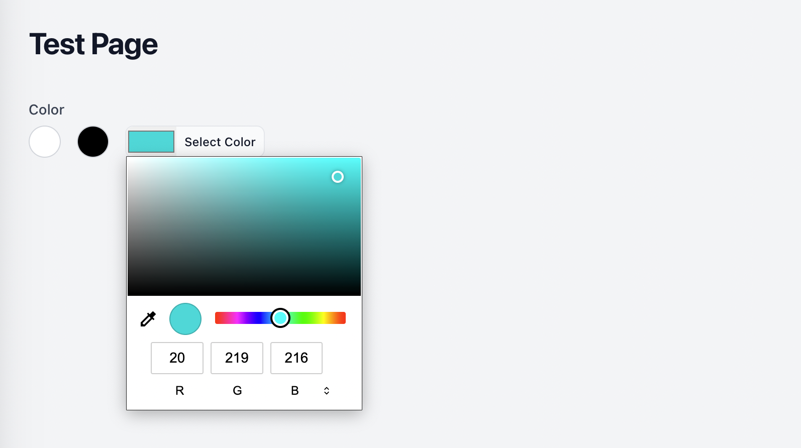

# Let users pick a color from a fixed list of options.

[](https://packagist.org/packages/ryangjchandler/filament-color-palette)
[](https://github.com/ryangjchandler/filament-color-palette/actions?query=workflow%3Arun-tests+branch%3Amain)
[](https://github.com/ryangjchandler/filament-color-palette/actions?query=workflow%3A"Check+%26+fix+styling"+branch%3Amain)
[](https://packagist.org/packages/ryangjchandler/filament-color-palette)

This packages implements a new `ColorPalette` field as described in [the mini-series on my blog](https://ryangjchandler.co.uk/posts/building-a-custom-color-palette-field-in-filament-part-0).

It gives users a fixed set of color options to choose from and the option to choose an arbitrary custom color.



## Installation

You can install the package via Composer:

```bash
composer require ryangjchandler/filament-color-palette
```

## Usage

Add the field to your form like so:

```php
use RyanChandler\FilamentColorPalette\ColorPalette;

ColorPalette::make('color')
    ->options([
        '#ffffff' => 'White',
        '#ff0000' => 'Red',
        '#000000' => 'Black',
    ]),
```

### Store color name instead of code

You may wish to store the name (label) of a color instead of the color code. This can be achieved by calling the `storeColorName()` method on the field.

```php
ColorPalette::make('color')
    ->storeColorName()
    ->options([
        '#ffffff' => 'White',
        '#ff0000' => 'Red',
        '#000000' => 'Black',
    ]),
```

Now instead of the hex codes being stored, the name from the options array will be used instead.

### Custom colors

If you want your users to have some more freedom, you can allow them to choose custom colors. Call the `->allowCustomColors()` method on the field and a custom color picker will appear in the options.

```php
ColorPalette::make('color')
    ->allowCustomColors()
    ->options([
        '#ffffff' => 'White',
        '#ff0000' => 'Red',
        '#000000' => 'Black',
    ]),
```

## Changelog

Please see [CHANGELOG](CHANGELOG.md) for more information on what has changed recently.

## Contributing

Please see [CONTRIBUTING](.github/CONTRIBUTING.md) for details.

## Security Vulnerabilities

Please review [our security policy](../../security/policy) on how to report security vulnerabilities.

## Credits

- [Ryan Chandler](https://github.com/ryangjchandler)
- [All Contributors](../../contributors)

## License

The MIT License (MIT). Please see [License File](LICENSE.md) for more information.
